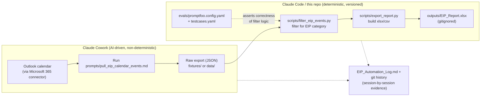

# EIP Helper Project

Automates quarterly EIP (Engage portal) reporting by pulling Outlook calendar
events, flagging the ones tagged with the "EIP" category, and producing a
clean report — with a deterministic, testable core so the pipeline can be
evaluated and its history tracked as proof for internal AI-maturity
certification (Stage 3).

## Architecture

Two-stage pipeline, split across two tools deliberately:

1. **Cowork (extraction stage)** — uses the Microsoft 365 connector to pull
   Outlook calendar events (handles Graph API auth/pagination/category
   fields, which is fragile to reimplement from scratch). Output is saved as
   raw JSON into `fixtures/` or a dated `data/` drop — not committed with
   secrets, just event metadata.
2. **This repo / Claude Code (processing + eval stage)** — deterministic
   Python filters the raw export for EIP-tagged events and builds the final
   report. This logic is versioned in git and covered by the promptfoo eval
   suite in `evals/`, so correctness can be proven on every run rather than
   assumed.



The split is deliberate: Cowork owns the fragile, connector-dependent part
(Graph API auth, pagination, category fields) where an AI agent's judgment
adds value; this repo owns the deterministic part (filtering, report
formatting) where correctness needs to be proven by an eval suite rather
than trusted each run.

## Layout

```
EIP-Helper-Project/
├── fixtures/                 # sample/raw calendar exports (test inputs)
│   └── sample_calendar_export.json
├── scripts/
│   ├── filter_eip_events.py  # core deterministic filtering logic
│   └── export_report.py      # builds the final xlsx/csv report
├── evals/
│   ├── promptfoo.config.yaml # eval suite wired to the filter script
│   └── testcases.yaml        # expected inputs/outputs for assertions
├── outputs/                   # generated reports (gitignored)
├── EIP_Automation_Log.md      # running session-by-session changelog
├── requirements.txt
├── package.json               # promptfoo dependency
└── .gitignore
```

## Running the filter/export locally

```bash
pip install -r requirements.txt
python scripts/export_report.py fixtures/sample_calendar_export.json outputs/EIP_Report.xlsx
```

## Running the evals

```bash
npm install
npx promptfoo eval -c evals/promptfoo.config.yaml
```

A green `promptfoo eval` run is the evidence artifact for "evaluations that
prove the tool works every run" — it re-runs the filter logic against known
fixtures and asserts the EIP-flagged events and row counts are exactly right.

## Session history

See `EIP_Automation_Log.md` for the running log of what changed each working
session (in lieu of relying on chat history alone). Combined with git commit
history, this satisfies the "worked on this across 5+ sessions" evidence
requirement.
